# دليل بناء البوت في Corbit — مرجع الفريق الفنّي

> دليل تشغيلي مصوّر لفريق الدعم الفنّي في Corbit. يشرح كل أداة في صفحة "بناء البوت" بالخطوات، مع مثال عملي لبناء بوت دعم فنّي كامل من الصفر للنشر، وكيفيّة اختبار كل عقدة قبل التسليم للعميل.

---

## الفهرس

1. [الواجهة الرئيسيّة — منشئ البوتات](#1-الواجهة-الرئيسيّة)
2. [إنشاء بوت جديد](#2-إنشاء-بوت-جديد)
3. [محرّر التدفّق — التخطيط العامّ](#3-محرّر-التدفّق)
4. [العقد التسعة — مرجع كامل بالحقول الفعليّة](#4-العقد-التسعة)
   - 4.1 [Trigger — المحفّز](#41-trigger)
   - 4.2 [Message — رسالة](#42-message)
   - 4.3 [Buttons — أزرار](#43-buttons)
   - 4.4 [Condition — شرط](#44-condition)
   - 4.5 [AI — ذكاء اصطناعي](#45-ai)
   - 4.6 [Input — إدخال](#46-input)
   - 4.7 [Transfer — تحويل](#47-transfer)
   - 4.8 [API — استدعاء خارجي](#48-api)
   - 4.9 [End — نهاية](#49-end)
5. [ربط العقد](#5-ربط-العقد)
6. [اختبار البوت — وضع المحاكاة](#6-اختبار-البوت)
7. [مثال كامل: بوت دعم فنّي بـ 7 عقد](#7-مثال-كامل-بوت-دعم-فنّي)
8. [النشر + إعدادات Cooldown](#8-النشر)
9. [استكشاف الأخطاء](#9-استكشاف-الأخطاء)

---

## 1. الواجهة الرئيسيّة

من الـ sidebar، اضغط **"بناء البوت"**. ستظهر صفحة "منشئ البوتات":

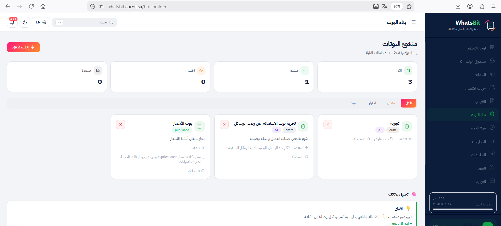

### المكوّنات

| العنصر | الوظيفة |
|--------|---------|
| **زرّ "+ إنشاء تدفق"** | فتح modal بوت جديد (يسار أعلى) |
| **Stats Cards (4)** | الكل / منشور / اختبار / مسودة — عدّاد سريع لحالات البوتات |
| **Tabs** | فلتر القائمة حسب الحالة |
| **بطاقات البوتات** | كل بطاقة تعرض: الاسم، الحالة (published/draft)، AI badge، عدد العقد، عدد المحادثات، الكلمات المحفّزة |
| **زرّ ✕ في كلّ بطاقة** | حذف البوت (تأكيد قبل الحذف) |
| **شريط "تحليل بوتاتك"** | اقتراحات AI لتحسين البوتات الموجودة (أسفل الصفحة) |

### حالات البوت

- **منشور** (badge أخضر): فعّال يستجيب للعملاء.
- **مسودة** (badge رمادي): محفوظ لكن لا يستجيب.
- **اختبار**: متاح للاختبار الداخلي فقط.

---

## 2. إنشاء بوت جديد

اضغط **"+ إنشاء تدفق"** أعلى الصفحة. ستفتح هذه الـ modal:

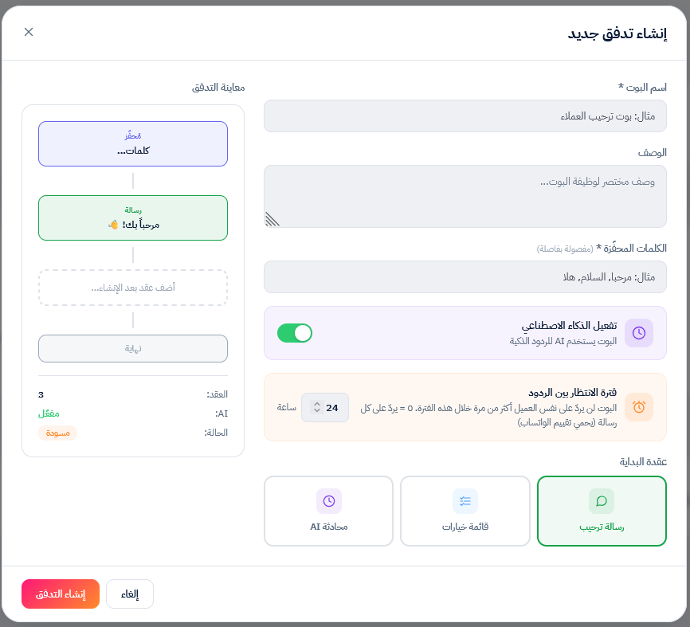

### الحقول

| الحقل | شرح | مثال |
|------|-----|------|
| **اسم البوت** * | عنوان داخلي يظهر للموظّفين فقط | `بوت الدعم الفنّي` |
| **الوصف** | ملاحظة للفريق تشرح الغرض (اختياري) | `يستقبل طلبات الدعم ويحوّل للفريق المناسب` |
| **الكلمات المحفّزة** * | الكلمات اللي تشغّل البوت، مفصولة بفواصل | `دعم, مساعدة, مشكلة, اشكي` |
| **تفعيل الذكاء الاصطناعي** | toggle لتفعيل AI في الفلو (يمكن إضافة AI node لاحقاً) | شغّل لو رح تستخدم AI Node |
| **فترة الانتظار بين الردود** | Cooldown — الساعات بين تكرار البوت لنفس العميل | افتراضي 24 ساعة. `0` = يردّ على كل رسالة |
| **عقدة البداية** | الشكل الأوّلي للفلو: ترحيب / أزرار / AI | اختر حسب نوع البوت |

### عقدة البداية — الفرق بين الخيارات الثلاثة

- **رسالة ترحيب**: ينشئ فلو بـ Trigger → Message → End. مناسب للبوت الذي يردّ بمعلومة ثابتة.
- **قائمة خيارات**: ينشئ فلو بـ Trigger → Buttons. مناسب للبوت الذي يوجّه العميل لخيارات.
- **محادثة AI**: ينشئ فلو بـ Trigger → AI. مناسب للبوت الذي يجيب بـ AI من البداية.

> **توصية للدعم الفنّي**: ابدأ بـ "قائمة خيارات" — هذا النمط الأكثر استخداماً في بوتات الدعم.

---

## 3. محرّر التدفّق

بعد إنشاء البوت، يفتح المحرّر:

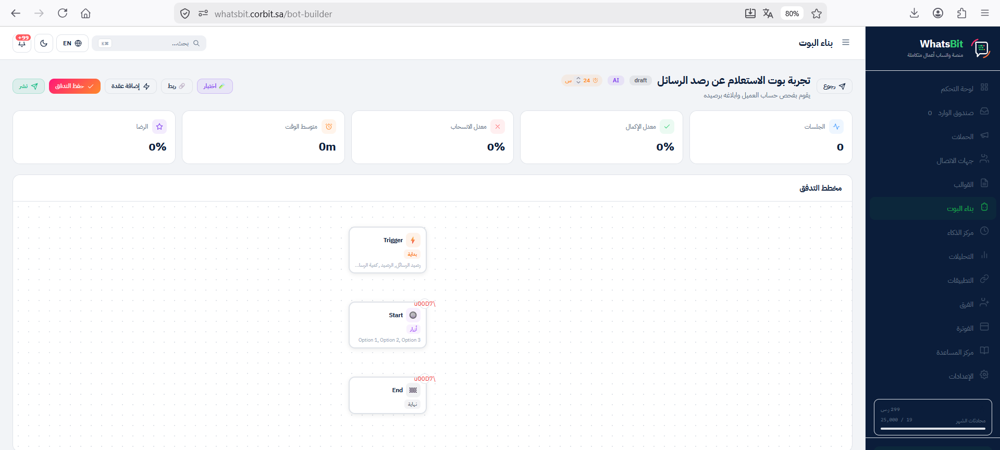

### المكوّنات

**Header علوي** (من اليسار لليمين):
- **زرّ "نشر"** (أزرق): تبديل حالة البوت بين Published/Draft.
- **زرّ "حفظ التدفق"** (برتقالي): يحفظ تغييرات الفلو على الخادم.
- **زرّ "إضافة عقدة"**: dropdown لإضافة نوع عقدة جديد.
- **زرّ "ربط"**: تفعيل وضع ربط العقد.
- **زرّ "اختيار"**: العودة لوضع التحديد الافتراضي.
- **زرّ "رجوع"** (يمين): العودة لصفحة قائمة البوتات.

**عنوان البوت + badges**: اسم البوت، الحالة (draft/published)، AI badge، Cooldown (24 س).

**Stats Cards (5)**: الجلسات / معدل الإكمال / معدل الانسحاب / متوسط الوقت / الرضا.

**Canvas** (المنطقة الكبيرة): الفلو معروض كشجرة عقد متّصلة.

**Sidebar إعدادات العقدة** (يظهر عند الضغط على عقدة): حقول التعديل الخاصّة بالعقدة المختارة.

---

## 4. العقد التسعة

### 4.1 Trigger

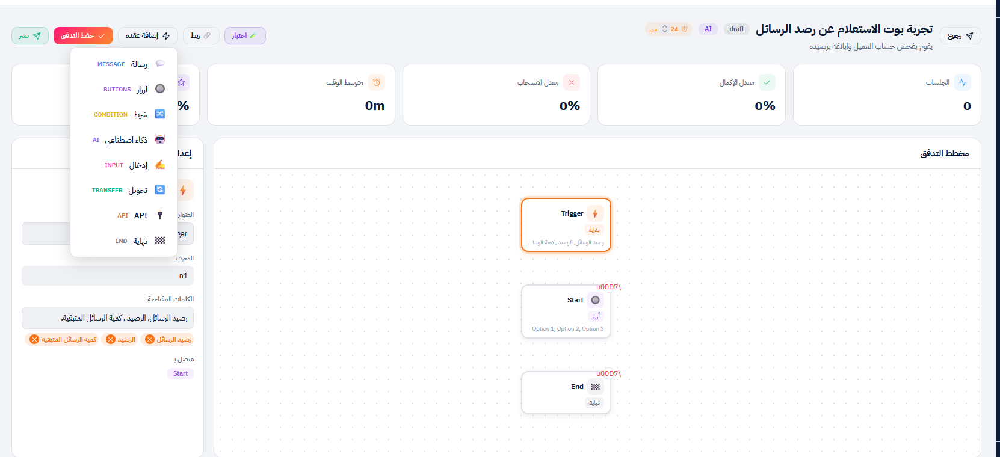

**الوظيفة**: نقطة دخول البوت. أيّ بوت يبدأ بهذه العقدة فقط.

**العدد المسموح**: واحدة لكلّ بوت (تُنشأ تلقائياً، لا تظهر في dropdown "إضافة عقدة").

**الحقول**:

| الحقل | الوصف |
|------|-------|
| **العنوان** | اسم العقدة في الكانفس (افتراضي: Trigger) |
| **المعرف** | ID فريد للعقدة (لا تعدّله إلّا لو تعرف ما تفعل) |
| **الكلمات المفتاحية** | قائمة كلمات تشغّل البوت، تظهر كـ tags (اضغط ✕ للحذف) |
| **متصل بـ** | العقدة التالية في الفلو |

**نصائح لكلمات Trigger**:
- استخدم **كل المرادفات + الأخطاء الإملائيّة الشائعة** (`دعم, مساعده, مساعدة, مشكلة`).
- **بدون مسافات حول الفاصلة** (`دعم,مساعدة` لا `دعم , مساعدة`).
- **كلمات قصيرة** (1-3 كلمات) لأنّ المطابقة تستلزم النصّ كاملاً يطابق إحدى الكلمات.

**اختبار**: في وضع الاختبار، اكتب أيّاً من الكلمات المفتاحية وتحقّق أنّ البوت يبدأ.

---

### 4.2 Message

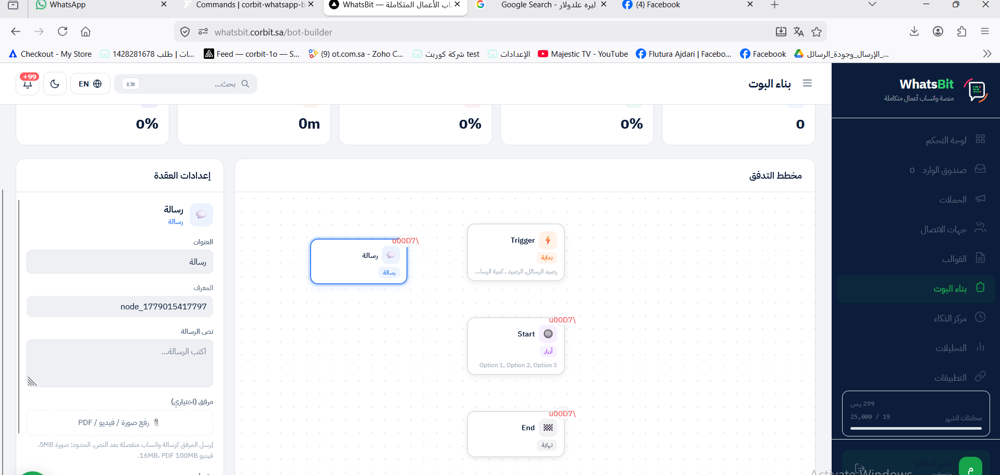

**الوظيفة**: إرسال نصّ ثابت للعميل (مع مرفق اختياري).

**الحقول**:

| الحقل | الوصف | الحدود |
|------|-------|--------|
| **العنوان** | اسم العقدة في الكانفس | — |
| **المعرف** | ID فريد | — |
| **نص الرسالة** | المحتوى المُرسَل للعميل | حدّ واتساب 4096 حرف |
| **مرفق (اختياري)** | صورة / فيديو / PDF يُرسَل بعد النصّ | صورة 5MB، فيديو 16MB، PDF 100MB |
| **متصل بـ** | العقدة التالية | — |

**نصائح للنصّ**:
- استخدم **فواصل أسطر** للوضوح (Enter داخل النصّ).
- **Emoji مدعومة** ✅.
- المرفق يُرسَل **كرسالة منفصلة بعد النصّ** (مش inline).
- اسم الملفّ الأصلي يصل للعميل (مثلاً `كتالوج-2026.pdf`).

**اختبار**: في وضع الاختبار، أرسل الـ Trigger وتأكّد أنّ النصّ + المرفق يظهران بالترتيب الصحيح.

---

### 4.3 Buttons

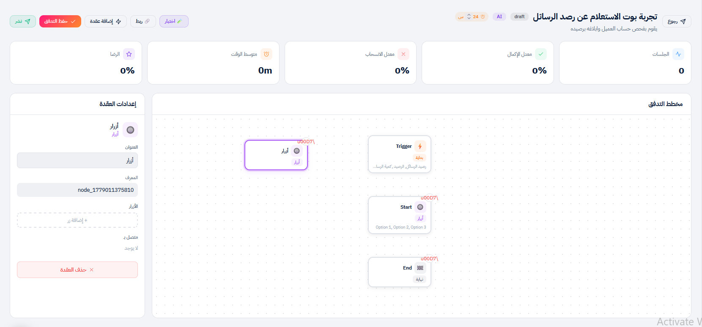

**الوظيفة**: عرض قائمة أزرار للعميل للاختيار.

**الحقول**:

| الحقل | الوصف |
|------|-------|
| **العنوان** | اسم العقدة |
| **المعرف** | ID فريد |
| **الأزرار** | قائمة نصوص، اضغط "+ إضافة زر" لكل واحد. أقصى 3 أزرار (حدّ واتساب) |
| **متصل بـ** | كلّ زرّ يُربط بعقدة مختلفة |

**القيود المهمّة**:
- **أقصى 3 أزرار** — الزرّ الرابع يُتجاهل من واتساب.
- **أقصى 20 حرف لكلّ زرّ**.
- **لا Emoji** في نصّ الزرّ — واتساب يرفض أحياناً.

**كيف تربط كلّ زرّ بعقدة مختلفة**:
1. أنشئ العقد التالية أوّلاً (مثلاً 3 عقد Transfer).
2. اضغط على Buttons → اضغط زرّ "ربط" في الـ header.
3. اضغط على الزرّ المراد ربطه → اضغط على العقدة الهدف.
4. كرّر لكلّ زرّ.

**اختبار**: في وضع الاختبار، تظهر الأزرار كخيارات قابلة للضغط — تأكّد أنّ كل واحد يقود للعقدة الصحيحة.

---

### 4.4 Condition

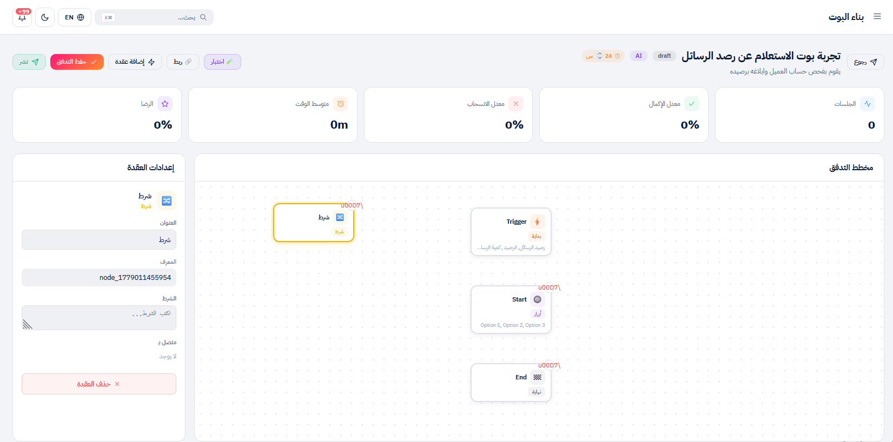

**الوظيفة**: تفريع المسار بناءً على قيمة متغيّر سابق.

**الحقول**:

| الحقل | الوصف |
|------|-------|
| **الشرط** | تعبير منطقي يستخدم متغيّرات من عقد Input سابقة |
| **متصل بـ** | عقد متعدّدة (إحداها لـ "نعم"، أخرى لـ "لا") |

**أمثلة على التعابير**:
| التعبير | المعنى |
|---------|--------|
| `{{score}} >= 80` | الـ score المحفوظ من Input سابق أكبر من أو يساوي 80 |
| `{{country}} == "SA"` | الـ country = "SA" |
| `{{order_id}} != ""` | حقل order_id ليس فارغاً |

**نصائح**:
- المتغيّر بصيغة `{{var_name}}`.
- النصوص بعلامتي تنصيص مزدوجتين `"value"`.
- لمنطق معقّد (أكثر من شرطين)، استخدم AI Node بدلاً.

---

### 4.5 AI

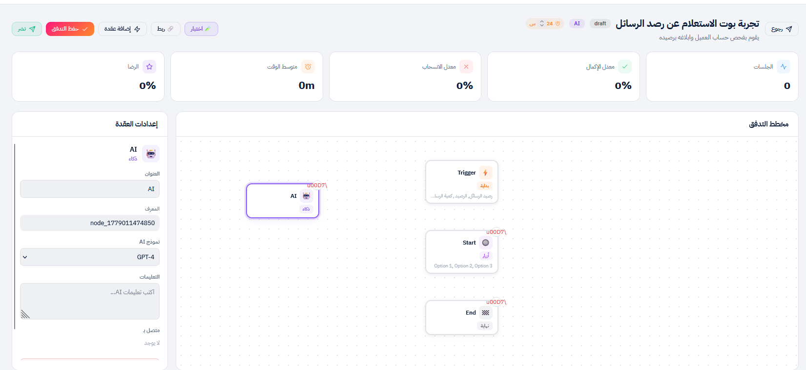

**الوظيفة**: توليد ردّ ديناميكي عبر AI بناءً على رسالة العميل.

**الحقول**:

| الحقل | الوصف |
|------|-------|
| **نموذج AI** | dropdown: GPT-4 (افتراضي) |
| **التعليمات** | system prompt يوجّه AI كيف يردّ |
| **متصل بـ** | العقدة التالية بعد ردّ AI |

**التعليمات** — أمثلة:

**للدعم العامّ**:
```
أنت مساعد دعم فنّي لشركة Corbit. ردّ بإيجاز واحترافيّة.
لا تخمّن — لو ما عندك إجابة، حوّل العميل لإنسان.
استخدم لغة عربيّة فصحى بسيطة.
```

**للمبيعات**:
```
أنت مندوب مبيعات لمنصّة Corbit. اعرض الباقات (Starter/Business/Enterprise)
وأسعارها (299/799/1999 ر.س شهري). اختم بدعوة للاشتراك أو الحجز التجريبي.
```

**ملاحظات مهمّة**:
- لا يوجد حقل KB في الـ UI الحالي — التعليمات هي المصدر الوحيد للسياق.
- تكلفة كل ردّ تُخصم من رصيد AI (راجع صفحة "مركز الذكاء").
- لو الردّ لم يجب على سؤال العميل، AI لا يحوّل تلقائياً للإنسان — لازم تضيف Condition بعد AI أو Transfer كـ fallback.

**اختبار**: اكتب أسئلة متنوّعة (متوقّعة + غير متوقّعة) وتحقّق من جودة الردود.

---

### 4.6 Input

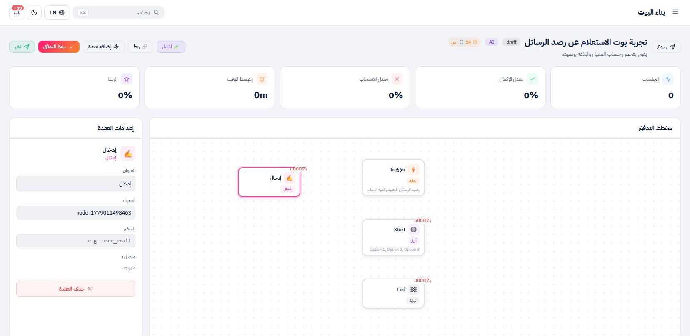

**الوظيفة**: التقاط ردّ العميل وحفظه في متغيّر لاستخدامه لاحقاً.

**الحقول**:

| الحقل | الوصف |
|------|-------|
| **المتغير** | اسم لحفظ ردّ العميل فيه (مثلاً `user_email`, `order_id`) |
| **متصل بـ** | العقدة التالية |

**كيف يعمل**:
1. البوت يصل لعقدة Input ويتوقّف.
2. ينتظر ردّ العميل التالي.
3. يحفظ النصّ في المتغيّر المُحدَّد.
4. ينتقل للعقدة التالية.

**استخدام المتغيّر لاحقاً**:
- في Message: `مرحباً {{user_email}}`
- في Condition: `{{order_id}} != ""`
- في API: في الـ URL `https://api.example.com/orders/{{order_id}}`

**ملاحظة على الـ UI**:
- ما فيه حقل "السؤال" في الـ UI الحالي. لازم تسبق عقدة Input بعقدة Message تطرح السؤال (مثلاً "ما رقم طلبك؟").

**نصائح لاسم المتغيّر**:
- بالإنجليزي فقط، snake_case.
- أمثلة جيّدة: `customer_phone`, `complaint_type`, `order_id`.

---

### 4.7 Transfer

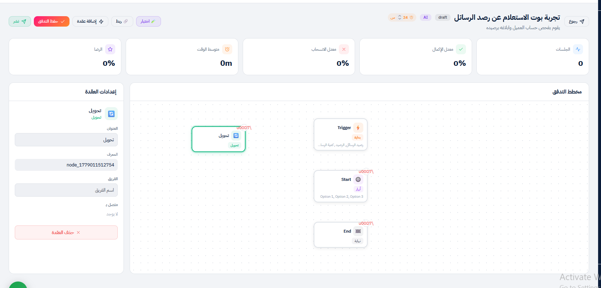

**الوظيفة**: تحويل المحادثة من البوت لفريق بشري.

**الحقول**:

| الحقل | الوصف |
|------|-------|
| **الفريق** | اسم فريق مُعرَّف مسبقاً في Settings → Teams |

**ما يحدث بعد التحويل**:
1. البوت يتوقّف عن الردّ على هذا العميل.
2. المحادثة تظهر في Inbox الفريق المحدّد بـ priority عالية.
3. أوّل موظّف يفتحها يُعيَّن لها.
4. العميل لا يستلم أيّ رسالة تلقائيّة — الموظّف يبدأ المحادثة يدوياً.

**شرط مهمّ**: لازم اسم الفريق **مطابق تماماً** لاسم في Settings → Teams. إذا الاسم غلط، التحويل يفشل بصمت.

**نصائح**:
- عرّف الفرق أولاً من Settings → Teams قبل بناء البوت.
- استخدم نفس النصّ بدون اختلاف في المسافات أو الأحرف.
- لو الفريق فارغ، استخدم فريق احتياطي بدلاً.

---

### 4.8 API

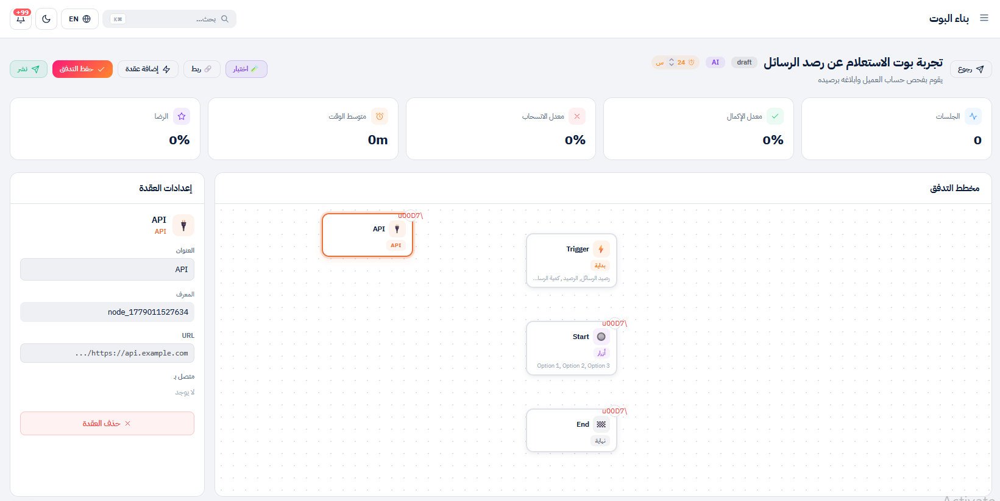

**الوظيفة**: استدعاء HTTP خارجي لجلب بيانات من نظامك الداخلي.

**الحقول**:

| الحقل | الوصف |
|------|-------|
| **URL** | عنوان الـ endpoint، يدعم متغيّرات `{{var}}` |

**ملاحظة على الـ UI الحالي**:
- ما فيه حقول لـ Method/Headers/Body في الـ UI. الـ endpoint يجب أن يقبل GET request.
- لـ POST + Headers مخصّصة، تواصل مع فريق Corbit للحصول على tailored integration.

**أمثلة على الاستخدام**:
- جلب حالة طلب: `https://shop.example.com/api/orders/{{order_id}}`
- التحقّق من رصيد: `https://crm.example.com/api/customers/{{phone}}/balance`

**ملاحظة فنّيّة**: ميزة API Node لا تزال أساسيّة. للحالات المعقّدة، نستخدم Webhook خارجي + AI Node بدل API Node.

---

### 4.9 End

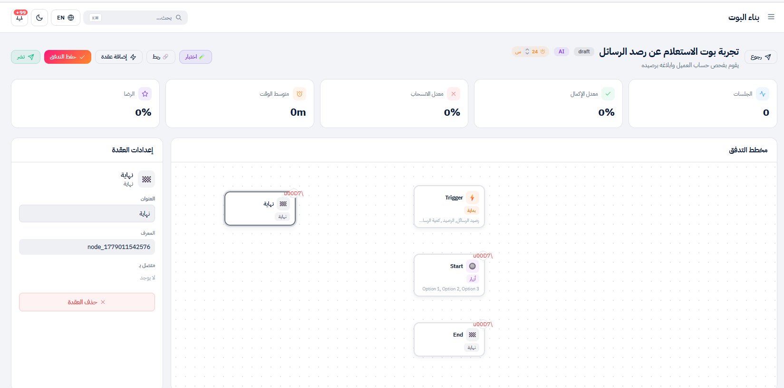

**الوظيفة**: إنهاء التدفّق. لا حقول.

**الحقول**:

| الحقل | الوصف |
|------|-------|
| **العنوان** | الاسم في الكانفس (افتراضي: نهاية) |
| **المعرف** | ID فريد |
| **متصل بـ** | لا اتّصال بعدها (هي النهاية) |

**نصائح**:
- كلّ مسار في الفلو يجب أن ينتهي بـ End أو Transfer.
- بدون End، البوت "يعلق" والعميل لا يستلم إشارة الانتهاء.

---

## 5. ربط العقد

اضغط **"ربط"** في الـ header → الزرّ يتحوّل لـ "إلغاء الربط (Esc)" + يظهر banner:

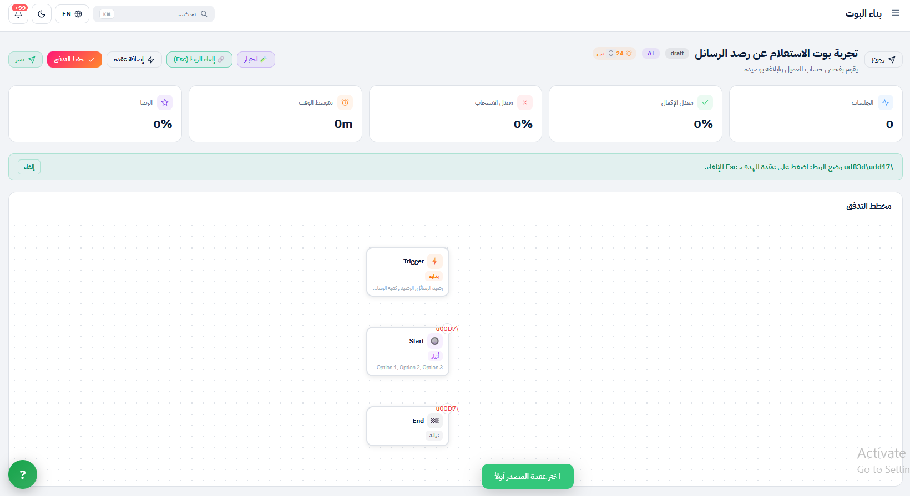

### الخطوات

1. اضغط **"ربط"** → الزرّ يتحوّل لـ "إلغاء الربط (Esc)".
2. اضغط على **عقدة المصدر** (مثلاً Buttons) — تتحدّد بإطار ملوّن.
3. اضغط على **عقدة الهدف** (مثلاً Transfer "دعم فنّي").
4. يظهر زرّ أخضر **"تم الربط ✓"** أسفل الكانفس.

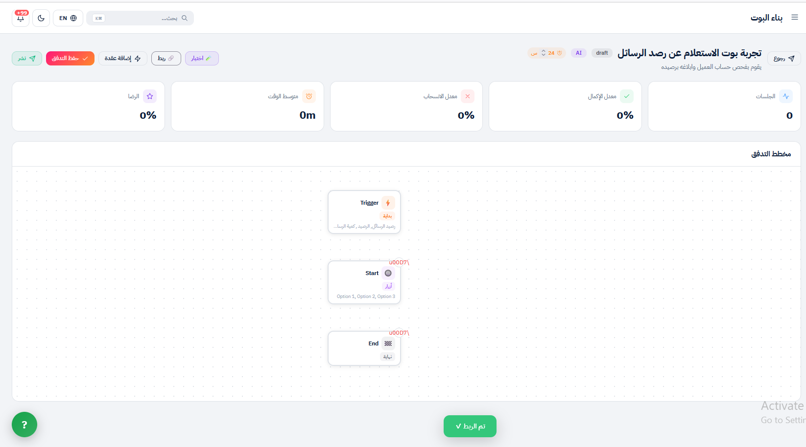

### إلغاء الربط بين عقدتين

- اضغط على عقدة المصدر → في الـ sidebar، احذف الاتّصال من قسم "متصل بـ".

### اختصارات

- **Esc**: إلغاء وضع الربط.
- بعد ربط ناجح، الـ button يعود لوضع "ربط" تلقائياً ليسمح بربط جديد.

---

## 6. اختبار البوت

اضغط **زرّ Test** (يظهر في بعض الإصدارات بجانب نشر). تنفتح لوحة محاكاة:

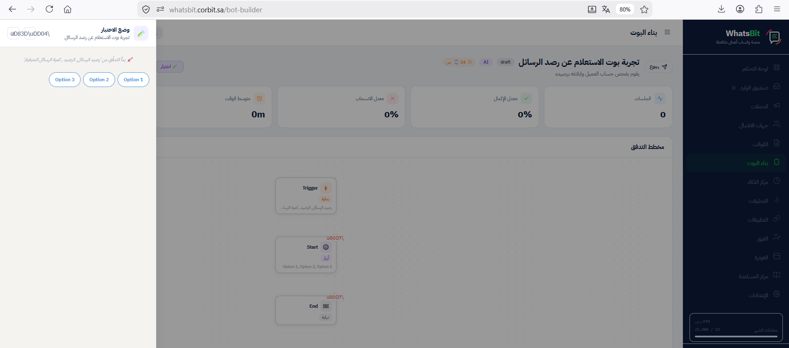

### كيف تختبر

1. اضغط زرّ الـ Trigger (مثلاً "رصيد الرسائل" أو إحدى الكلمات المفتاحية).
2. شاهد ردّ البوت يظهر في اللوحة.
3. لو فيه أزرار، اضغط أحدها لمتابعة التدفّق.
4. لو فيه Input، اكتب نصّاً لمحاكاة ردّ العميل.
5. تابع حتّى End أو Transfer.

### ما تتأكّد منه قبل النشر

- ✅ Trigger يستجيب لكلّ الكلمات المفتاحية.
- ✅ Messages تظهر بدون أخطاء إملائيّة، Emoji تُعرَض، أسطر مفصولة بشكل صحيح.
- ✅ Buttons تظهر كلّها (max 3)، وكل واحد يقود للعقدة الصحيحة.
- ✅ AI ينتج ردّ منطقي (جرّب سؤال متوقّع + سؤال غير متوقّع).
- ✅ Transfer يحدّد الفريق الصحيح (تحقّق من الـ Inbox).
- ✅ كل مسار ينتهي بـ End أو Transfer (لا عقد معلّقة).
- ✅ Cooldown مناسب للحالة (24 ساعة للترحيب، 0 للـ FAQ).

---

## 7. مثال كامل: بوت دعم فنّي

**الهدف**: بوت يستقبل طلبات الدعم في Corbit، يصنّف العميل، ويحوّله للفريق المناسب.

### الـ Architecture

```
Trigger (دعم، مساعدة، مشكلة)
    ↓
Message (ترحيب + توضيح الخيارات)
    ↓
Buttons (3 خيارات)
    ├─→ Transfer (دعم فنّي)
    ├─→ Transfer (مبيعات)
    └─→ Transfer (فوترة)
```

### الخطوات بالتفصيل

#### 0. التجهيز المسبق

في **Settings → Teams**، عرّف الفرق الـ 3:
- `الدعم الفنّي` — أضف موظّفي الدعم.
- `المبيعات` — أضف فريق المبيعات.
- `الفوترة` — أضف المحاسبين.

#### 1. إنشاء البوت

من صفحة بناء البوت → اضغط **"+ إنشاء تدفق"**:
- الاسم: `بوت الدعم الفنّي - Corbit`
- الوصف: `يستقبل طلبات الدعم ويوجّهها للفريق المناسب`
- الكلمات المحفّزة: `دعم, مساعدة, مساعده, مشكلة, اشكي, support, help`
- تفعيل AI: ✗ (غير مطلوب لهذا البوت)
- Cooldown: `24` ساعة
- عقدة البداية: **قائمة خيارات**

اضغط **"إنشاء التدفق"** → ستُنقل لمحرّر التدفّق.

#### 2. إعداد Trigger

اضغط على عقدة Trigger → في الـ sidebar:
- الكلمات المفتاحية: `دعم, مساعدة, مساعده, مشكلة, اشكي, support, help` (تكون مضافة مسبقاً من الـ modal).

#### 3. إعداد رسالة الترحيب (Message)

اضغط **"+ إضافة عقدة" → رسالة**:
- النصّ:
```
أهلاً بك في دعم Corbit 👋

كيف نقدر نساعدك؟
اختر القسم المناسب من الأزرار أسفل الرسالة 👇
```

ثمّ اربط Trigger بهذه الـ Message.

#### 4. إعداد الأزرار (Buttons)

اضغط **"+ إضافة عقدة" → أزرار**:
- اضغط **"+ إضافة زر"** 3 مرّات:
  - `دعم فنّي`
  - `مبيعات`
  - `فوترة`

ثمّ اربط Message بـ Buttons.

#### 5. إضافة 3 عقد Transfer

أضف ثلاث عقد Transfer (كرّر "+ إضافة عقدة" → تحويل ثلاث مرّات):

| العقدة | الفريق |
|--------|--------|
| Transfer 1 | `الدعم الفنّي` |
| Transfer 2 | `المبيعات` |
| Transfer 3 | `الفوترة` |

#### 6. الربط بين الأزرار والعقد

اضغط **"ربط"** في الـ header، ثمّ:
1. اضغط Buttons → اضغط Transfer 1 (الدعم الفنّي). تم الربط ✓.
2. اضغط Buttons → اضغط Transfer 2 (المبيعات). تم الربط ✓.
3. اضغط Buttons → اضغط Transfer 3 (الفوترة). تم الربط ✓.

> **ملاحظة**: المنصّة تربط الأزرار بالعقد بترتيب الضغط — الزرّ الأوّل يذهب لأوّل Transfer ربطته، إلخ.

#### 7. الحفظ + الاختبار + النشر

- اضغط **"حفظ التدفق"** (برتقالي).
- اضغط زرّ الاختبار → جرّب الفلو من البداية لكلّ الـ 3 مسارات.
- بعد الرضى، اضغط **"نشر"**.

#### 8. سيناريو الاختبار الكامل

اختبر الـ 3 مسارات:

**مسار 1**: اكتب `دعم` → ترحيب → اضغط "دعم فنّي" → تحقّق أنّ المحادثة وصلت لفريق الدعم في Inbox.

**مسار 2**: اكتب `مشكلة` → ترحيب → اضغط "مبيعات" → تحقّق أنّ المحادثة وصلت لفريق المبيعات.

**مسار 3**: اكتب `help` → ترحيب → اضغط "فوترة" → تحقّق أنّ المحادثة وصلت لفريق الفوترة.

---

## 8. النشر

### حالات البوت

| الحالة | السلوك |
|--------|--------|
| **مسودة** (draft) | لا يستجيب للعملاء |
| **منشور** (published) | فعّال للعملاء |
| **اختبار** (testing) | متاح للاختبار الداخلي فقط |

### تبديل الحالة

اضغط زرّ **"نشر"** في الـ header. يتحوّل لـ "إيقاف" عند النشر.

### إعداد Cooldown

من الـ header، اضغط على badge "24 س" → عدّل القيمة (0-72).

**التوصيات**:
- **24 ساعة**: للبوت الترحيبي (تجنّب الإزعاج).
- **0 ساعات**: للبوت الـ FAQ (العميل قد يحتاج إعادة الإجابة).
- **72 ساعة**: الحدّ الأقصى (سياسة Meta).

### إيقاف مؤقّت

اضغط زرّ "إيقاف" → يرجع لحالة Draft دون حذف. يمكن إعادة التفعيل في أيّ وقت.

---

## 9. استكشاف الأخطاء

### البوت لا يستجيب

1. تحقّق من **الحالة** = منشور (Published).
2. تحقّق من **الكلمات المفتاحية** تطابق فعلاً ما يكتبه العميل.
3. تحقّق من **Cooldown** — العميل ربّما داخل النافذة.
4. تحقّق من **رقم الواتساب متّصل** (Settings → ربط الواتساب).

### AI Node يرفض الردّ

1. تحقّق من **رصيد AI** (مركز الذكاء → الرصيد).
2. تحقّق من **التعليمات** ليست فارغة.
3. تحقّق من **النموذج المختار** (GPT-4) متاح في حسابك.

### Transfer لا يحوّل للفريق

1. تحقّق من **اسم الفريق مطابق** لاسم في Settings → Teams (المسافات + الأحرف).
2. تحقّق من **الفريق فيه أعضاء** — فريق فارغ لا يستلم تحويلات.
3. تحقّق من **حالة الأعضاء = Online** (لو الـ assignment يستثني offline).

### الأزرار لا تظهر

1. تحقّق من **عدد الأزرار ≤ 3**.
2. تحقّق من **نصّ كلّ زرّ ≤ 20 حرف**.
3. احذف **Emoji** من نصوص الأزرار.

### المرفق يصل بدون اسم

- أُصلح في تحديث 2026-05-17. تأكّد إنّ المنصّة محدّثة.

### "تم الربط ✓" لم يظهر

- تأكّد إنّك ضغطت **عقدتين مختلفتين** (مصدر + هدف).
- لا يمكن ربط عقدة بنفسها أو ربط بعقدة Trigger.
- Esc يلغي وضع الربط.

### العقد تعرض `×` بدل أيقونات

- bug عرضي في إصدارات سابقة. لا يؤثّر على وظيفة البوت. سيُصلح في تحديث قريب.

---

## خلاصة الـ Checklist للفريق الفنّي

قبل تسليم بوت لعميل، تأكّد من:

- [ ] الفرق مُعرَّفة في Settings → Teams (للبوتات اللي فيها Transfer).
- [ ] الكلمات المفتاحية تغطّي كل المرادفات + أخطاء إملائيّة.
- [ ] كل مسار في الفلو ينتهي بـ End أو Transfer.
- [ ] Cooldown مناسب لنوع البوت.
- [ ] اختبار وضع الـ Test على كل المسارات.
- [ ] اختبار حيّ من رقم تجريبي قبل النشر للعملاء.
- [ ] البوت مُحفَّظ + منشور.

---

> الدليل مُحدَّث بتاريخ 2026-05-17 ويعكس واجهة Corbit الفعليّة. لأيّ استفسار، تواصل مع فريق التطوير.
